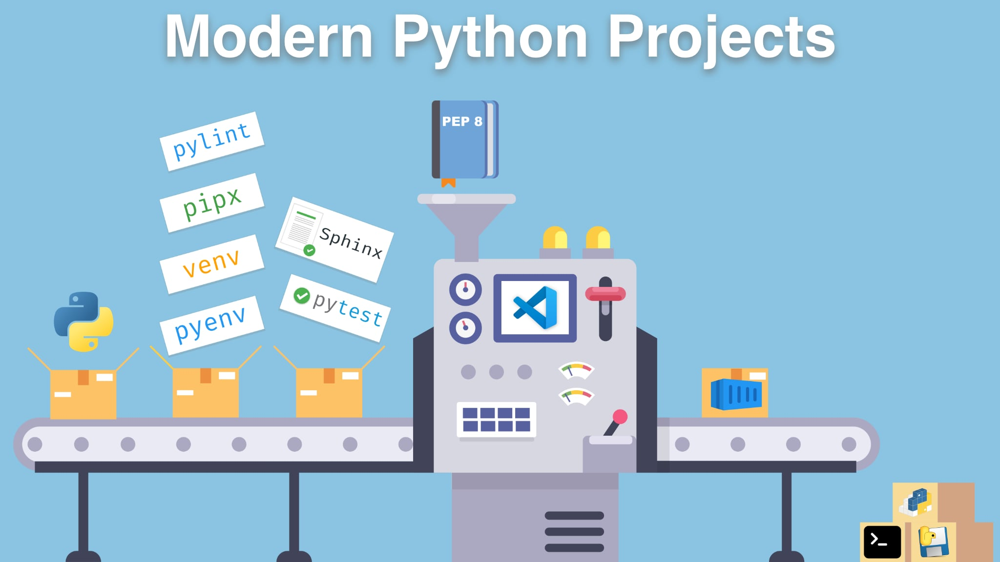

# [Modern Python Projects Course](https://talkpython.fm/modern-python-projects)

Modern Python Projects is a course that bridges the gap between "knowing Python" and "comfortably building Python applications." You will learn everything you need to know to set up a robust development environment, add helpful tools, and build typical Python projects.

## What you will learn

Modern Python Projects covers the following topics:

* Setting up VS Code for Python development - how to configure it, debug your code, run tests, and what plugins to install.
* Managing Python versions and packages, isolating dependencies between projects, and installing global packages.
* Using cookiecutter for a head start when creating a new project.
* Managing Python projects - how to write good requirements files, pin dependencies with pip-tools, manage tasks with Makefiles, and use Poetry to do all that at once.
* Adding formatters, linters, and other static analysis tools to make your code better.
* Testing your code with pytest - how to configure it, how to use fixtures, mocks, or parametrization, and what plugins to install.
* Documenting your code with Sphinx, automatically extracting the documentation from the code, and testing code examples.
* How to automate some typical tasks with tox and pre-commit. And how to do the same inside your code repository using continuous integration tools like GitHub Actions or GitLab CI.
* How to deploy your application using a Platform as a Service or Docker.

That's a lot of knowledge, so to put it into practice, we will build three projects on the way:

* A CLI application that you can run in your terminal.
* A Python package that we will publish on [PyPI](https://pypi.org/).
* An executable application that you can send to someone, and they will be able to run it without even having Python installed on their computer.

You can find all the additional links mentioned throughout this course at [modernpythonprojects.com/resources](https://modernpythonprojects.com/resources/).

## Who is this course for?

This course is for people who already know Python's basics, but who still struggle with using it in everyday work. If installing Python packages breaks things on your computer, you're not sure how to start a new Python projects, how to add tests and documentation, or what's the best way to deploy it - this course is for you.

In a few examples I use very simple Flask and FastAPI websites, but it's just a few lines of code and I explain everything.

## Sounds interesting?

[Take the course today at Talk Python Training](https://talkpython.fm/modern-python-projects).
